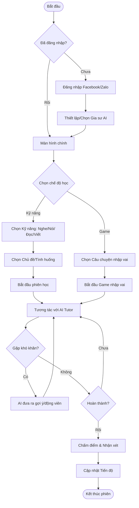
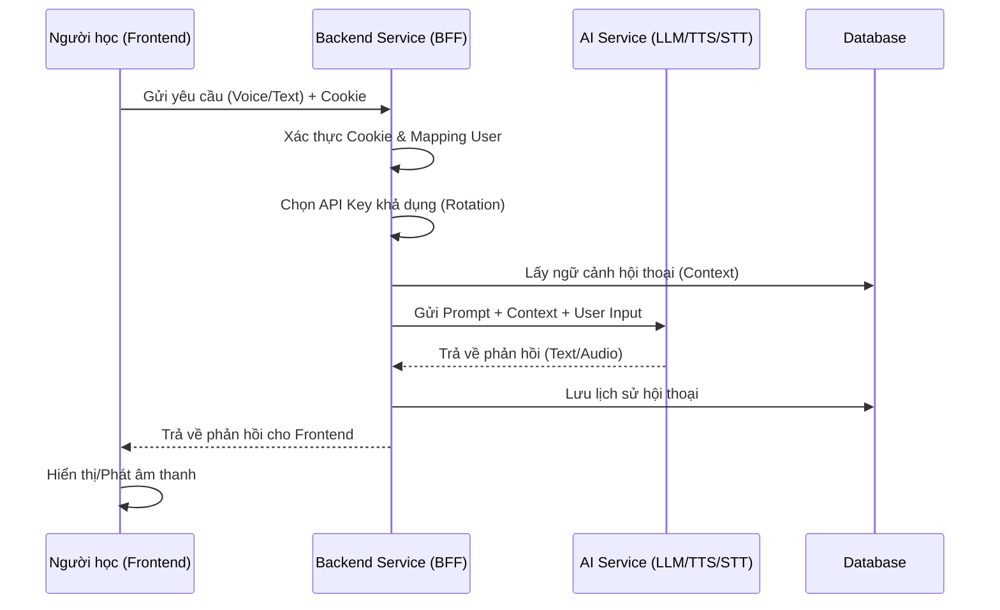

# Business Requirements Document (BRD) - Next Generation Private Tutor

## 1. Giới thiệu (Introduction)

**Next Generation Private Tutor (Next Tutor)** là một ứng dụng web huấn luyện tiếng Anh dành cho trẻ em dưới 16 tuổi, sử dụng công nghệ AI tiên tiến để đóng vai trò là gia sư ảo (Virtual Private Tutor). Dự án nhằm giải quyết vấn đề thiếu môi trường giao tiếp tiếng Anh tự nhiên và sự nhàm chán trong các phương pháp học tập truyền thống.

Ứng dụng tập trung vào việc tạo ra trải nghiệm học tập vui vẻ, tương tác cao thông qua Gamification và giao tiếp trực tiếp với AI, giúp trẻ cải thiện toàn diện 4 kỹ năng: Nghe, Nói, Đọc, Viết theo các chuẩn quốc tế (Cambridge, TOEIC Junior, IELTS Junior).

## 2. Mục tiêu kinh doanh (Business Objective)

Mục tiêu của dự án được xác định theo tiêu chí SMART:

* **S (Specific)**: Xây dựng và triển khai phiên bản MVP (Minimum Viable Product) của web app Next Tutor với đầy đủ các tính năng cốt lõi: chọn gia sư AI, luyện 4 kỹ năng, chế độ game nhập vai, và theo dõi tiến độ.
* **M (Measurable)**:
  * Hoàn thành 100% các tính năng trong phạm vi dự án (Scope).
  * Hệ thống hỗ trợ đồng thời ít nhất 50 người dùng (CCU) trong giai đoạn thử nghiệm mà không gặp lỗi về giới hạn token AI.
  * Tốc độ phản hồi của gia sư AI dưới 3 giây cho các tương tác voice/text.
* **A (Achievable)**: Khả thi để xây dựng trong vòng 1 tuần áp dụng phương pháp VIBE Coding với sự hỗ trợ của AI trong việc sinh mã nguồn và tài liệu. Sử dụng các công nghệ quen thuộc (Spring Boot/Python, Angular/React, PostgreSQL) và các API AI sẵn có.
* **R (Relevant)**: Phù hợp với nhu cầu học tiếng Anh ngày càng cao của trẻ em Việt Nam và xu hướng ứng dụng AI trong giáo dục (EdTech).
* **T (Time-bound)**: Hoàn thành bản MVP và sẵn sàng demo sau 1 tuần phát triển (7 ngày).

## 3. Các bên liên quan (Stakeholders)

| STT | Bên liên quan | Vai trò | Trách nhiệm | Mức độ tham gia |
| :-- | :--- | :--- | :--- | :--- |
| 1 | **Product Owner (PO)** | Người sở hữu sản phẩm | Định hướng tầm nhìn, phê duyệt yêu cầu, nghiệm thu sản phẩm cuối cùng. | Cao (Quyết định) |
| 2 | **Development Team** | Đội ngũ phát triển (AI + Human) | Phân tích, thiết kế, lập trình (Frontend, Backend, AI Integration), kiểm thử và triển khai. | Cao (Thực hiện) |
| 3 | **AI Experts** | Chuyên gia AI (AI Agents) | Hỗ trợ sinh code, tối ưu prompt cho gia sư ảo, tư vấn giải pháp kỹ thuật. | Cao (Hỗ trợ kỹ thuật) |
| 4 | **End Users (Học viên)** | Trẻ em (5-16 tuổi) | Sử dụng phần mềm để học tập, cung cấp phản hồi về trải nghiệm. | Thấp (Người dùng cuối) |
| 5 | **Parents (Phụ huynh)** | Người giám hộ | Đăng nhập, thiết lập ban đầu, theo dõi tiến độ học tập của con. | Trung bình (Người dùng gián tiếp) |

## 4. Phạm vi dự án (Scope)

### 4.1. Các tính năng trong phạm vi (In-Scope)

Dựa trên yêu cầu hoàn thành trong 1 tuần, các tính năng sau sẽ được ưu tiên:

1. **Quản lý tài khoản & Xác thực**:
    * Đăng nhập qua OAuth2 (Facebook, Zalo).
    * Lưu trữ thông tin người dùng cơ bản.
2. **Cấu hình Gia sư ảo (AI Tutor)**:
    * Lựa chọn nhân vật (Avatar), giới tính, tính cách.
3. **Học tập & Luyện tập**:
    * **Speaking & Listening**: Voice chat trực tiếp với AI theo tình huống (Scenario-based).
    * **Reading & Listening**: Bài tập dạng Quiz (Trắc nghiệm).
    * **Writing**: Bài tập sắp xếp từ thành câu (Sentence Scramble).
    * **Gamification**: Chế độ nhập vai (Role-play) theo cốt truyện cổ tích.
4. **Hệ thống phản hồi & Đánh giá**:
    * Chấm điểm phát âm (Speaking scoring) - mức độ cơ bản.
    * Gợi ý (Hint) và động viên (Encouragement) từ AI khi người học gặp khó khăn.
5. **Báo cáo tiến độ**:
    * Dashboard xem kết quả học tập theo ngày/tuần.
6. **Hạ tầng kỹ thuật**:
    * Backend (BFF pattern) quản lý API Key, bảo mật.
    * Cơ chế xoay vòng API Key (Key Rotation) cho AI Service.
    * PWA (Progressive Web App) cơ bản.

### 4.2. Các tính năng ngoài phạm vi (Out-of-Scope)

* Thanh toán online, gói cước Premium.
* Chức năng mạng xã hội (kết bạn, thi đấu đối kháng realtime).
* Quản trị nội dung (CMS) phức tạp cho admin (sử dụng prompt/config file thay thế).
* Mobile App Native (chỉ tập trung Web/PWA).

## 5. Quy trình nghiệp vụ (Business Process)

### 5.1. Quy trình Học tập tổng quát (General Learning Flow)

### 5.2. Quy trình Xử lý tương tác AI (AI Interaction Process - BFF Pattern)

## 6. Yêu cầu về báo cáo và phân tích (Reporting and Analysis)

Hệ thống cần cung cấp các báo cáo đơn giản, trực quan cho người học và phụ huynh:

1. **Biểu đồ hoạt động (Activity Chart)**:
    * Loại: Heatmap hoặc Bar chart.
    * Dữ liệu: Số phút học tập mỗi ngày trong tuần.
2. **Biểu đồ kỹ năng (Skill Radar)**:
    * Loại: Radar Chart (Biểu đồ mạng nhện).
    * Dữ liệu: Điểm số trung bình của 4 kỹ năng (Nghe, Nói, Đọc, Viết).
3. **Lịch sử tiến bộ**:
    * Danh sách các bài học/game đã hoàn thành.
    * Điểm số và nhận xét ngắn gọn từ AI cho mỗi phiên.

## 7. Các ràng buộc và giả định (Constraints and Assumptions)

### 7.1. Ràng buộc (Constraints)

* **Thời gian**: 1 tuần (7 ngày) để hoàn thiện MVP.
* **Công nghệ**:
  * Backend: Spring Boot hoặc Python (FastAPI/Django).
  * Frontend: Angular hoặc React/Vue (ưu tiên framework team thành thạo nhất).
  * Database: PostgreSQL.
  * AI Integration: Sử dụng API của Grok, Gemini, OpenAI (qua cơ chế rotation).
* **Bảo mật**: Tuyệt đối không lưu API Key dưới Frontend.

### 7.2. Giả định (Assumptions)

* Người dùng có kết nối Internet ổn định để sử dụng các dịch vụ AI (Voice/Text).
* Các dịch vụ AI (Grok, Gemini) hoạt động ổn định và phản hồi trong thời gian chấp nhận được.
* Người dùng đã có tài khoản Facebook hoặc Zalo để đăng nhập.

## 8. Yêu cầu về giao diện người dùng mức cao (High Level UI Requirements)

Giao diện cần tuân thủ nguyên tắc "Kid-friendly" (Thân thiện với trẻ em):

1. **Phong cách thiết kế (Visual Style)**:
    * **Màu sắc**: Tươi sáng, độ bão hòa cao (Vàng, Xanh dương, Cam, Xanh lá). Tránh màu quá tối hoặc neon chói mắt.
    * **Typography**: Font chữ tròn trịa, kích thước lớn, dễ đọc (ví dụ: Quicksand, Nunito, hoặc Comic Neue).
    * **Iconography**: Sử dụng icon dạng hình khối, hoạt hình, dễ thương.

2. **Bố cục (Layout)**:
    * Tối giản, ít chữ, nhiều hình ảnh minh họa.
    * Các nút bấm (Button) kích thước lớn (Big touch targets) để dễ thao tác trên màn hình cảm ứng.
    * Không sử dụng menu đa cấp phức tạp. Sử dụng thanh điều hướng đáy (Bottom Navigation) hoặc thanh bên lớn (Sidebar) với icon rõ ràng.

3. **Trải nghiệm tương tác (Interaction)**:
    * **Voice-first**: Ưu tiên tương tác bằng giọng nói. Nút Micro phải luôn nổi bật khi cần nói.
    * **Feedback tức thì**: Có hiệu ứng âm thanh/hình ảnh vui nhộn khi trả lời đúng (confetti, tiếng vỗ tay) hoặc sai (âm thanh nhẹ nhàng, icon khích lệ).
    * **Loading State**: Sử dụng skeleton hoặc animation nhân vật đang suy nghĩ thay vì vòng xoay loading nhàm chán.

4. **Các màn hình chính (Key Screens)**:
    * **Landing/Login**: Nút đăng nhập to, hình ảnh nhân vật chào đón.
    * **Tutor Selection**: Carousel (trượt ngang) để chọn nhân vật gia sư.
    * **Home Dashboard**: Bản đồ hành trình học tập (Learning Path) hoặc danh sách thẻ bài học dạng lưới.
    * **Practice Screen**:
        * Khu vực hiển thị Avatar gia sư (có chuyển động/biểu cảm).
        * Khu vực chat bubble (bong bóng chat) to, rõ.
        * Khu vực điều khiển (Micro, Nút gợi ý).
