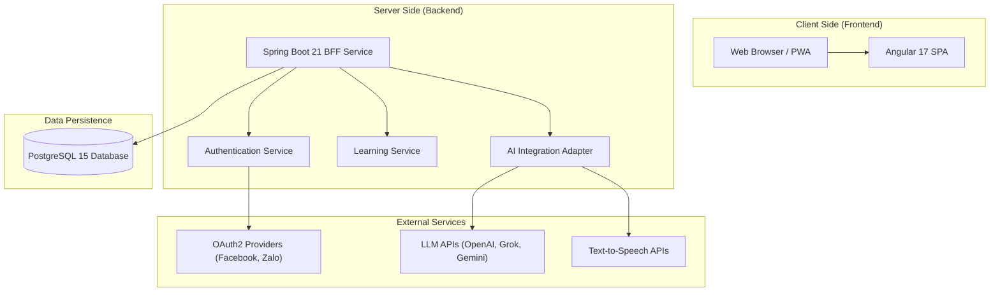
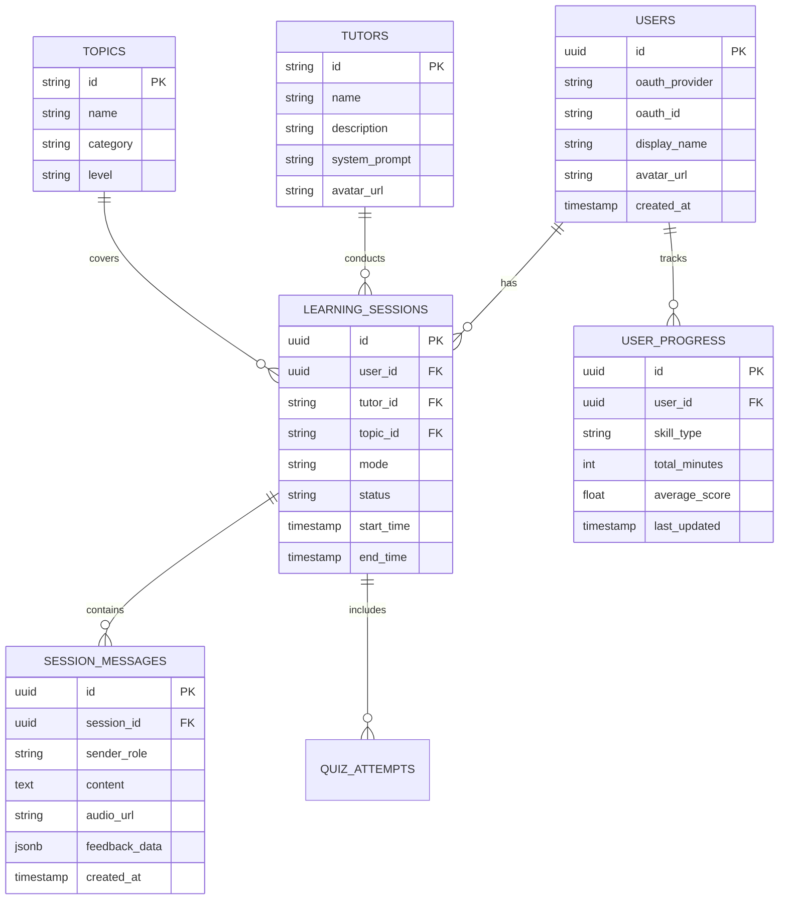

# Detailed Design Document - Next Generation Private Tutor

## 1. Kiến trúc tổng thể (Architecture)

### 1.1. Sơ đồ kiến trúc hệ thống (System Architecture Diagram)

Hệ thống Next Tutor được thiết kế theo kiến trúc Microservices đơn giản hóa (Modular Monolith) hoặc Service-Oriented Architecture (SOA) để phù hợp với quy mô MVP nhưng vẫn đảm bảo khả năng mở rộng.



### 1.2. Mô tả các thành phần

* **Frontend (Angular 17)**: Ứng dụng Single Page Application (SPA) chịu trách nhiệm hiển thị giao diện người dùng, xử lý tương tác (ghi âm, kéo thả), và giao tiếp với Backend qua REST API.

* **Backend API (Spring Boot 21)**: Đóng vai trò là Backend API, xử lý logic nghiệp vụ, xác thực, và điều phối các yêu cầu tới Database và AI Services.

* **Backend BFF (Spring Boot 21)**: Đóng vai trò là BFF đồng thời là API Gateway (Backend For Frontend), xử lý logic xác thực, và điều phối các yêu cầu tới Backend API. BFF chịu trách nhiệm chuyển đổi các yêu cầu từ Frontend thành các yêu cầu hợp lệ tới Backend API. Frontend chỉ cần giao tiếp với BFF. Frontend không lưu trữ thông tin xác thực người dùng như JWT Token, mà chỉ lưu trữ Cookie Session ID. BFF sử dụng Cookie Session ID mà Frontend cung cấp để xác thực người dùng thông qua việc ánh xạ Cookie Session ID tới JWT Token mà nó duy trì trên local memory cache. Sau khi xác thực người dùng thành công, BFF sẽ chuyển đổi Cookie Session ID thành JWT Token và lưu trữ JWT Token trong local memory cache. BFF sẽ sử dụng JWT Token để xác thực người dùng thông qua các yêu cầu tới Backend API.

* **Database (PostgreSQL 15)**: Lưu trữ thông tin người dùng, cấu hình gia sư, lịch sử phiên học, kho câu hỏi kèm đáp án cho các bài quiz, kho game role-play, và dữ liệu tiến độ.

* **AI Service Adapter**: Module trong Backend chịu trách nhiệm giao tiếp với các mô hình LLM và TTS, quản lý Context, và thực hiện Rotation API Key. Trong phiên bản hiện tại của phần mềm, AI Service Adapter sẽ sử dụng các API của OpenAI, các phiên bản sau này sẽ sử dụng thêm các API của Gemini và Grok, việc thiết kế AI Service Adapter sẽ được thực hiện theo hướng mở rộng để dễ dàng thêm các API mới.

## 2. Thiết kế API Backend (API Design)

### 2.1. Authentication & User Management

#### 2.1.1. Login with OAuth2

* **Endpoint**: `POST /api/v1/auth/login`
* **Mô tả**: Xác thực người dùng thông qua token từ OAuth Provider (Facebook/Zalo). Nếu người dùng chưa tồn tại, hệ thống sẽ tự động tạo mới.
* **Request**:

    ```json
    {
      "provider": "FACEBOOK", // hoặc "ZALO"
      "accessToken": "string" // Token nhận được từ SDK của provider
    }
    ```

* **Response (200 OK)**:

    ```json
    {
      "token": "jwt_string", // JWT dùng cho các request tiếp theo
      "user": {
        "id": "uuid",
        "displayName": "string",
        "avatarUrl": "string",
        "role": "LEARNER"
      }
    }
    ```

* **Logic xử lý**:
    1. Backend verify `accessToken` với Provider API.
    2. Lấy thông tin profile (email, id, name).
    3. Tìm User trong DB theo `oauth_id`.
    4. Nếu chưa có -> Insert User mới.
    5. Tạo JWT Session Token và trả về.

### 2.2. AI Tutor Configuration

#### 2.2.1. Get Available Tutors

* **Endpoint**: `GET /api/v1/tutors`
* **Mô tả**: Lấy danh sách các nhân vật gia sư AI khả dụng.
* **Response (200 OK)**:

    ```json
    [
      {
        "id": "tutor_bear",
        "name": "Mr. Bear",
        "description": "Thân thiện, giọng trầm ấm, thích kể chuyện.",
        "avatarUrl": "/assets/tutors/bear.png",
        "personalityPrompt": "You are Mr. Bear, a friendly and patient English tutor..."
      },
      // ...
    ]
    ```

### 2.3. Learning & Practice

#### 2.3.1. Start Learning Session (Speaking/Role-play)

* **Endpoint**: `POST /api/v1/sessions/start`
* **Mô tả**: Khởi tạo một phiên học mới (Speaking hoặc Role-play).
* **Request**:

    ```json
    {
      "tutorId": "tutor_bear",
      "mode": "SPEAKING", // SPEAKING, ROLE_PLAY
      "topicId": "topic_travel", // Hoặc storyId cho Role-play
      "level": "A2" // Trình độ học viên
    }
    ```

* **Response (200 OK)**:

    ```json
    {
      "sessionId": "uuid",
      "initialMessage": {
        "text": "Hello! I'm Mr. Bear. Let's talk about travel today. Where do you want to go?",
        "audioUrl": "/api/v1/audio/tts/welcome_msg.mp3"
      }
    }
    ```

* **Logic xử lý**:
    1. Tạo bản ghi `learning_sessions` trong DB.
    2. Khởi tạo Context cho AI dựa trên `tutorId`, `topicId`, `level`.
    3. Gọi AI Service để sinh câu chào mở đầu.
    4. Gọi TTS Service để chuyển văn bản thành âm thanh.
    5. Lưu message vào `session_messages`.

#### 2.3.2. Send User Input (Voice/Text)

* **Endpoint**: `POST /api/v1/sessions/{sessionId}/interact`
* **Mô tả**: Gửi nội dung nói/viết của người dùng tới AI và nhận phản hồi.
* **Request**:

    ```json
    {
      "inputType": "TEXT", // hoặc AUDIO (nếu gửi file ghi âm trực tiếp, cần multipart/form-data)
      "content": "I want to go to Japan." // Text đã STT ở client hoặc raw text
    }
    ```

* **Response (200 OK)**:

    ```json
    {
      "aiResponse": {
        "text": "Japan is a beautiful country! What do you like about Japan?",
        "audioUrl": "/api/v1/audio/tts/response_123.mp3"
      },
      "feedback": {
        "score": 4, // 1-5
        "correction": "Good sentence. You can also say: 'I would like to visit Japan.'",
        "pronunciationErrors": [] // Nếu có phân tích audio
      }
    }
    ```

* **Logic xử lý**:
    1. Load Context của session từ DB.
    2. Append User Input vào Context.
    3. Chọn API Key (Rotation Strategy).
    4. Gửi Context + Input tới LLM (OpenAI/Grok/Gemini).
    5. Nhận phản hồi Text từ LLM.
    6. (Optional) Gọi LLM khác để chấm điểm/sửa lỗi (Feedback).
    7. Gọi TTS Service sinh Audio.
    8. Lưu lịch sử hội thoại vào DB.

#### 2.3.3. Get Quiz

* **Endpoint**: `GET /api/v1/quizzes`
* **Request Params**: `level=A2&skill=READING&topic=SCIENCE`
* **Response**:

    ```json
    {
      "quizId": "uuid",
      "questions": [
        {
          "id": "q1",
          "type": "MULTIPLE_CHOICE",
          "content": "The sun rises in the...",
          "options": ["West", "East", "North", "South"],
          "audioUrl": null
        }
      ]
    }
    ```

#### 2.3.4. Submit Quiz Answer

* **Endpoint**: `POST /api/v1/quizzes/{quizId}/submit`
* **Request**:

    ```json
    {
      "answers": [
        { "questionId": "q1", "selectedOption": "East" }
      ]
    }
    ```

* **Response**:

    ```json
    {
      "score": 10,
      "totalQuestions": 10,
      "details": [
        {
          "questionId": "q1",
          "isCorrect": true,
          "explanation": "The sun always rises in the East due to Earth's rotation."
        }
      ]
    }
    ```

#### 2.3.5. Get Hint

* **Endpoint**: `POST /api/v1/sessions/{sessionId}/hint`
* **Mô tả**: Yêu cầu AI đưa ra gợi ý khi người dùng gặp khó khăn trong phiên học.
* **Request**:

    ```json
    {
      "context": "I don't know what to say about the weather." // Optional user note
    }
    ```

* **Response (200 OK)**:

    ```json
    {
      "hintText": "You can say: 'The weather is sunny and warm.'",
      "hintAudioUrl": "/api/v1/audio/tts/hint_123.mp3"
    }
    ```

### 2.4. AI Core & Utility Services

#### 2.4.1. AI Service Adapter
* **Mô tả**: Module trong Backend chịu trách nhiệm giao tiếp với các mô hình LLM và TTS, quản lý Context, và thực hiện Rotation API Key. Module này gồm nhiều endpoint để giao tiếp với các mô hình LLM và TTS. Không chỉ đóng vai trò là giao diện cho các mô hình LLM và TTS, mà Module này còn chịu trách nhiệm quản lý Context và Rotation API Key. Nhằm đảm bảo quá trình giao tiếp với các mô hình LLM và TTS không bị gián đoạn bởi lỗi out of context-window hoặc lãng phí chi phí sử dụng token, Module này sẽ thực hiện các biện pháp sau:
    1. Tự quản lý Context: thông qua chiến lược "Lưu + Cắt + Tóm tắt", cụ thể:
      1. Lưu trữ cuộc hội thoại: mỗi cuộc hội thoại được lưu tại bảng `session_messages` sẽ có session_id, mỗi message trong cuộc hội thoại sẽ lưu các thông tin như:
        - id, session_id
        - sender_role: USER, ASSISTANT, SYSTEM
        - content
        - created_at
        - token_count
      2. Dựng context theo "sliding window + summary": Mẫu context sẽ bao gồm:
        - system prompt: cố định theo mỗi tutor_id, topic_id, level, master_prompt. Chương trình sẽ load system prompt từ bảng `system_prompts` và có cơ chế chống prompt injection để không cho user override system prompt, trước mắt có thể thiết kế tạm một hàm validate input trước khi gán vào context.
        - summary: tóm tắt các message trước đó, kèm theo việc pin các facts quan trọng (ví dụ: "user thích trả lời ngắn", "user không thích nịnh", ...)
        - last N messages: các message gần nhất (ví dụ 10-20 messages gần nhất). Việc summary sẽ được thực hiện khi tổng số token vượt quá giới hạn và thực hiện bằng cách gọi API tới LLM với model giá rẻ nhất có thể. Mỗi lần xử lý summary sẽ đi kèm với việc cập nhật các facts quan trọng và bền vững gắn với user vào bảng `user_facts` với các thông tin như `user_id`, `fact_name`, `fact_value`, `created_at`, `updated_at`.
        Khi tổng số token vượt quá giới hạn, sẽ cắt bỏ các message cũ nhất, và tạo summary mới.
      3. Cắt bỏ message cũ nhất: cắt bỏ message cũ nhất khỏi prompt gửi đi, chỉ duy trì N messages gần nhất (giá trị N này được cấu hình trong config file). Các message cũ vẫn được lưu trữ trong bảng `session_messages` và sẽ được sử dụng để xây dựng chân dung người dùng cho các cuộc hội thoại tiếp theo.
      4. Rotation API Key: Hệ thống sẽ lưu trữ các API key của các model LLM và TTS trong bảng `api_keys` với các thông tin như `api_key`, `model_name`, `model_type`, `model_provider`, `model_region`, `model_version`, `price_level`, `is_active`, `created_at`, `updated_at`. Hệ thống sẽ chọn API key ngẫu nhiên để gọi API tới LLM và TTS, và khi API key hết hạn, hệ thống sẽ chọn API key ngẫu nhiên khác.
        

#### 2.4.2. Speech-to-Text (STT)

* **Endpoint**: `POST /api/v1/ai/stt`
* **Mô tả**: Chuyển đổi giọng nói thành văn bản (Fallback khi browser STT không hoạt động).
* **Request**: `multipart/form-data`
  * `file`: Audio file (wav, mp3, webm).
* **Response (200 OK)**:

    ```json
    {
      "text": "Hello world",
      "confidence": 0.95
    }
    ```

#### 2.4.3. Text-to-Speech (TTS)

* **Endpoint**: `POST /api/v1/ai/tts`
* **Mô tả**: Chuyển đổi văn bản thành giọng nói (Ad-hoc usage).
* **Request**:

    ```json
    {
      "text": "Hello world",
      "voiceId": "alloy" // hoặc tutor_id
    }
    ```

* **Response (200 OK)**:
  * Trả về file audio stream (audio/mpeg).

#### 2.4.4. Pronunciation Assessment

* **Endpoint**: `POST /api/v1/ai/assessment/pronunciation`
* **Mô tả**: Đánh giá phát âm của người dùng dựa trên mẫu câu chuẩn.
* **Request**: `multipart/form-data`
  * `audio`: User recording.
  * `targetText`: "The quick brown fox jumps over the lazy dog."
* **Response (200 OK)**:

    ```json
    {
      "score": 85, // 0-100
      "phonemes": [
        { "phoneme": "ð", "isGood": true },
        { "phoneme": "ə", "isGood": true },
        { "phoneme": "k", "isGood": false, "suggestion": "Make it sharper" }
      ],
      "overallFeedback": "Good job, but watch your 'k' sound."
    }
    ```

## 3. Thiết kế Cơ sở dữ liệu (Database Design)

### 3.1. Entity-Relationship Diagram (ERD)



### 3.2. Data Definition Language (DDL)

```sql
-- Users Table
CREATE TABLE users (
    id UUID PRIMARY KEY DEFAULT gen_random_uuid(),
    oauth_provider VARCHAR(50) NOT NULL, -- 'FACEBOOK', 'ZALO'
    oauth_id VARCHAR(255) NOT NULL,
    display_name VARCHAR(255),
    avatar_url TEXT,
    created_at TIMESTAMP WITH TIME ZONE DEFAULT CURRENT_TIMESTAMP,
    last_login TIMESTAMP WITH TIME ZONE DEFAULT CURRENT_TIMESTAMP,
    UNIQUE(oauth_provider, oauth_id)
);

-- Tutors Table (Static data mostly)
CREATE TABLE tutors (
    id VARCHAR(50) PRIMARY KEY, -- e.g., 'tutor_bear'
    name VARCHAR(100) NOT NULL,
    description TEXT,
    system_prompt TEXT NOT NULL, -- Prompt định hình tính cách
    avatar_url TEXT
);

-- Topics Table
CREATE TABLE topics (
    id VARCHAR(50) PRIMARY KEY,
    name VARCHAR(100) NOT NULL,
    category VARCHAR(50), -- 'TRAVEL', 'DAILY_LIFE'
    min_level VARCHAR(20) -- 'A1', 'A2'
);

-- Learning Sessions
CREATE TABLE learning_sessions (
    id UUID PRIMARY KEY DEFAULT gen_random_uuid(),
    user_id UUID REFERENCES users(id),
    tutor_id VARCHAR(50) REFERENCES tutors(id),
    topic_id VARCHAR(50) REFERENCES topics(id),
    mode VARCHAR(20) NOT NULL, -- 'SPEAKING', 'ROLE_PLAY', 'QUIZ'
    status VARCHAR(20) DEFAULT 'ACTIVE', -- 'ACTIVE', 'COMPLETED'
    start_time TIMESTAMP WITH TIME ZONE DEFAULT CURRENT_TIMESTAMP,
    end_time TIMESTAMP WITH TIME ZONE
);

-- Session Messages (Chat History)
CREATE TABLE session_messages (
    id UUID PRIMARY KEY DEFAULT gen_random_uuid(),
    session_id UUID REFERENCES learning_sessions(id),
    sender_role VARCHAR(20) NOT NULL, -- 'USER', 'AI'
    content TEXT NOT NULL,
    audio_url TEXT,
    feedback_data JSONB, -- Lưu điểm số, gợi ý sửa lỗi cho message này
    created_at TIMESTAMP WITH TIME ZONE DEFAULT CURRENT_TIMESTAMP
);

-- User Progress (Aggregated Data)
CREATE TABLE user_progress (
    id UUID PRIMARY KEY DEFAULT gen_random_uuid(),
    user_id UUID REFERENCES users(id),
    skill_type VARCHAR(20) NOT NULL, -- 'SPEAKING', 'LISTENING', 'READING', 'WRITING'
    total_minutes INTEGER DEFAULT 0,
    total_sessions INTEGER DEFAULT 0,
    average_score FLOAT DEFAULT 0.0,
    last_updated TIMESTAMP WITH TIME ZONE DEFAULT CURRENT_TIMESTAMP,
    UNIQUE(user_id, skill_type)
);
```

## 4. Thiết kế Frontend Components (Angular 17)

### 4.1. Cấu trúc thư mục (Folder Structure)

```
src/
  app/
    core/               # Singleton services, guards, interceptors
      auth/             # AuthService, AuthGuard
      services/         # ApiService, LearningService, AudioService
      models/           # User, Session, Message interfaces
    shared/             # Reusable components, pipes, directives
      components/       # Button, Card, LoadingSpinner
      ui/               # Design system components
    features/           # Feature modules
      auth/             # LoginComponent
      dashboard/        # DashboardComponent (Progress charts)
      tutor-selection/  # TutorSelectionComponent
      learning/         # LearningModule
        components/
          chat-interface/   # Chat bubble, input area
          voice-recorder/   # Mic button, visualizer
          feedback-modal/   # Correction display
        pages/
          speaking-page/
          role-play-page/
          quiz-page/
    app.routes.ts       # Route definitions
    app.component.ts    # Root component
```

### 4.2. Các Component chính

#### 4.2.1. ChatInterfaceComponent

* **Mục đích**: Hiển thị hội thoại giữa User và AI.
* **Input**: `messages: Message[]`, `isAiTyping: boolean`.
* **Output**: `onSendMessage: EventEmitter<string>`.
* **UI/UX**:
  * Sử dụng bong bóng chat (Chat Bubbles) với màu sắc khác nhau cho User và AI.
  * Avatar của Tutor hiển thị cạnh tin nhắn AI.
  * Auto-scroll xuống tin nhắn mới nhất.

#### 4.2.2. VoiceRecorderComponent

* **Mục đích**: Ghi âm giọng nói người dùng.
* **Output**: `onAudioRecorded: EventEmitter<Blob>`.
* **UI/UX**:
  * Nút Micro lớn, đổi màu/hiệu ứng sóng âm (Visualizer) khi đang ghi âm.
  * Nhấn giữ để nói, thả ra để gửi (Hold-to-talk) hoặc Nhấn để bắt đầu/dừng (Toggle).

#### 4.2.3. DashboardComponent

* **Mục đích**: Hiển thị tiến độ học tập.
* **Data**: Lấy từ `UserProgress` API.
* **UI/UX**:
  * Biểu đồ cột cho số phút học trong tuần (sử dụng thư viện như `ngx-charts` hoặc `chart.js`).
  * Radar chart cho 4 kỹ năng.

## 5. Chiến lược Tích hợp AI (AI Integration Strategy)

### 5.1. Quản lý API Key (Key Rotation)

* **Vấn đề**: Giới hạn Rate Limit và Quota của các Free/Paid Tier API (OpenAI, Gemini).
* **Giải pháp**:
  * Lưu danh sách API Keys trong cấu hình Backend (Environment Variables hoặc Secure Vault).
  * `AIServiceAdapter` duy trì một Pool các Keys.
  * Thuật toán Round-robin hoặc Least-used để chọn Key cho mỗi request.
  * Nếu gặp lỗi 429 (Too Many Requests), tự động chuyển sang Key tiếp theo và retry.

### 5.2. Quản lý Ngữ cảnh (Context Management)

* **Stateless API**: Các LLM API thường là stateless.
* **Giải pháp**:
  * Backend load `session_messages` gần nhất (ví dụ: 10 messages cuối) từ DB.
  * Construct prompt: `System Prompt` (từ bảng Tutors) + `Conversation History` + `New User Input`.
  * Gửi toàn bộ prompt này tới LLM.

### 5.3. Xử lý TTS/STT

* **STT (Speech-to-Text)**:
  * Sử dụng Web Speech API (trình duyệt) ở Frontend để giảm tải cho Server và tăng tốc độ phản hồi (nếu trình duyệt hỗ trợ tốt).
  * Fallback: Gửi Audio Blob về Backend -> gọi Whisper API (OpenAI) hoặc Google STT.
* **TTS (Text-to-Speech)**:
  * Backend gọi TTS API (OpenAI TTS, Google TTS) để sinh file MP3.
  * Cache file audio (nếu câu nói lặp lại) hoặc stream trực tiếp về client.

## 6. Xử lý lỗi và Bảo mật (Error Handling & Security)

### 6.1. Xử lý lỗi (Error Handling)

* **Global Exception Handler**: Spring Boot `@ControllerAdvice` để bắt các exception và trả về format chuẩn.

    ```json
    {
      "timestamp": "...",
      "status": 400,
      "error": "Bad Request",
      "message": "Invalid Topic ID",
      "path": "/api/v1/sessions/start"
    }
    ```

* **Frontend Interceptor**: Angular `HttpInterceptor` để bắt lỗi 401 (Unauthorized) -> Redirect về Login. Hiển thị Toast Notification cho lỗi 4xx/5xx.

### 6.2. Bảo mật (Security)

* **API Security**: Sử dụng Spring Security + JWT.
  * Tất cả API `/api/**` (trừ `/auth/**`) đều yêu cầu Header `Authorization: Bearer <token>`.
* **CORS**: Chỉ cho phép request từ domain của Frontend (localhost:4200 trong dev, domain production).
* **Data Privacy**:
  * Không log nội dung chat nhạy cảm ra file log server.
  * Dữ liệu Audio tạm thời có thể được xóa sau khi xử lý xong.

## 7. Kế hoạch triển khai (Deployment Plan) - MVP

* **Dockerize**:
  * `Dockerfile` cho Backend (Java 21 image).
  * `Dockerfile` cho Frontend (Nginx serving Angular build).
  * `docker-compose.yml` để chạy toàn bộ stack (App + DB) cục bộ.
* **Environment Variables**:
  * `DB_URL`, `DB_USER`, `DB_PASS`
  * `OPENAI_API_KEYS` (comma separated)
  * `GEMINI_API_KEYS`
  * `JWT_SECRET`

# 8. Tài liệu tham khảo (References)

- User Stories: [User Stories](../user-stories/1.user_stories.md)
- BRD: [BRD](../business-requirements/1.business_requirements.md)
- SRS: [SRS](../srs/1.srs_document_fine-tuned.md)
- UI/UX: [UI/UX](../detailed-designs/3.ui-ux-design.html)
- Coding convention: [Coding convention](../coding-conventions/1.coding_conventions.md)
