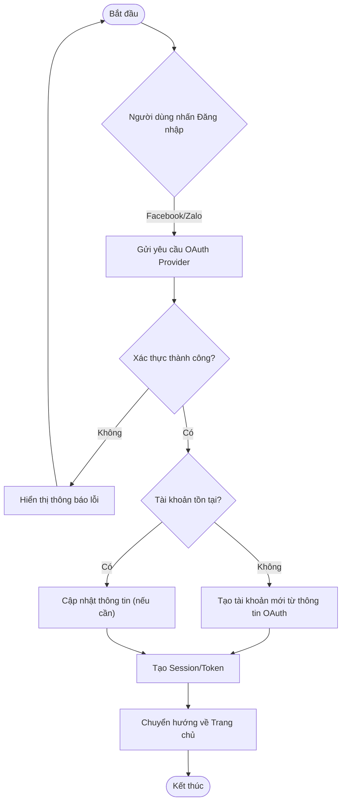
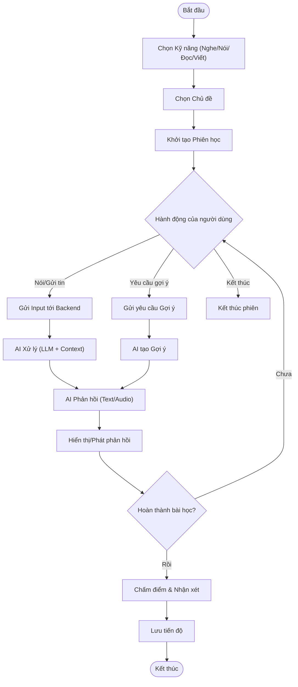
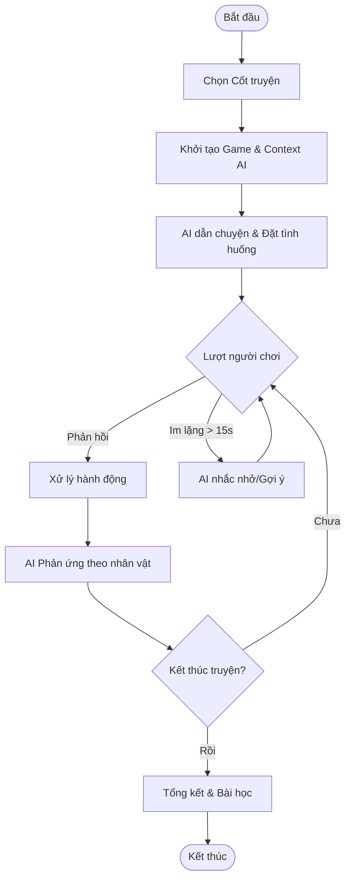

# Software Requirements Specification (SRS) - Next Generation Private Tutor

## 1. Giới thiệu (Introduction)

### 1.1. Mục đích (Purpose)

Tài liệu này mô tả chi tiết các yêu cầu phần mềm cho dự án **Next Generation Private Tutor (Next Tutor)**. Mục đích là cung cấp một cơ sở thống nhất cho đội ngũ phát triển (Development Team) và Product Owner (PO) về các chức năng, hiệu năng, và giao diện của phiên bản MVP (Minimum Viable Product). Tài liệu này cũng đóng vai trò là cơ sở để đội ngũ QA xây dựng kế hoạch và kịch bản kiểm thử.

### 1.2. Phạm vi (Scope)

Sản phẩm là một ứng dụng web (Web Application) hỗ trợ trẻ em (5-16 tuổi) học tiếng Anh thông qua tương tác với gia sư ảo AI. Phiên bản MVP tập trung vào các tính năng cốt lõi: xác thực người dùng, lựa chọn gia sư AI, luyện tập 4 kỹ năng (Nghe, Nói, Đọc, Viết) và chế độ game nhập vai.
Các tính năng nâng cao như thanh toán, mạng xã hội, và ứng dụng di động native nằm ngoài phạm vi của tài liệu này.

### 1.3. Định nghĩa và Thuật ngữ (Definitions and Acronyms)

* **MVP**: Minimum Viable Product - Sản phẩm khả thi tối thiểu.
* **AI Tutor**: Gia sư ảo được vận hành bởi các mô hình ngôn ngữ lớn (LLM).
* **BFF**: Backend For Frontend - Mẫu thiết kế backend phục vụ riêng cho frontend.
* **PWA**: Progressive Web App - Ứng dụng web có khả năng cài đặt và hoạt động giống ứng dụng native.
* **CCU**: Concurrent Users - Số lượng người dùng đồng thời.

## 2. Mô tả tổng quan (Overall Description)

### 2.1. Bối cảnh sản phẩm (Product Context)

Next Tutor là một hệ thống độc lập, bao gồm Frontend (Web/PWA), Backend (API Service), và tích hợp với các dịch vụ AI bên thứ ba (OpenAI, Grok, Gemini). Hệ thống sử dụng cơ sở dữ liệu PostgreSQL để lưu trữ thông tin người dùng và lịch sử học tập.

### 2.2. Chức năng chính (Product Functions)

* Đăng nhập/Đăng ký qua mạng xã hội.
* Cấu hình và tương tác với Gia sư AI (Voice/Text).
* Luyện tập kỹ năng qua các bài tập và trò chơi.
* Theo dõi tiến độ học tập.

### 2.3. Đặc điểm người dùng (User Characteristics)

* **Học viên (End User)**: Trẻ em 5-16 tuổi. Thích hình ảnh sinh động, tương tác đơn giản, ít kiên nhẫn với các thao tác phức tạp.
* **Phụ huynh**: Người hỗ trợ trẻ đăng nhập và theo dõi kết quả. Quan tâm đến sự an toàn và hiệu quả học tập.

## 3. Yêu cầu chức năng (Functional Requirements)

### 3.1. Quản lý tài khoản & Xác thực (Authentication)

* **FR-01**: Đăng nhập qua OAuth2.
  * *User Story*: Là một Học viên/Phụ huynh, tôi muốn đăng nhập bằng tài khoản Facebook hoặc Zalo để truy cập nhanh chóng mà không cần nhớ thêm mật khẩu.
  * *Acceptance Criteria*:
    * Hệ thống hiển thị nút "Đăng nhập bằng Facebook" và "Đăng nhập bằng Zalo".
    * Sau khi xác thực thành công, hệ thống tự động tạo tài khoản người dùng nếu chưa tồn tại và chuyển hướng vào màn hình chính.
    * Thông tin profile (tên, avatar) được đồng bộ từ mạng xã hội.

### 3.2. Cấu hình Gia sư ảo (AI Tutor Configuration)

* **FR-02**: Lựa chọn Gia sư AI.
  * *User Story*: Là một Học viên, tôi muốn chọn nhân vật gia sư (ví dụ: Gấu, Thỏ, Robot) và tính cách của họ để cảm thấy hứng thú hơn khi học.
  * *Acceptance Criteria*:
    * Người dùng có thể xem danh sách các nhân vật gia sư khả dụng (tối thiểu 3 nhân vật).
    * Mỗi nhân vật có hình ảnh đại diện, tên và mô tả tính cách ngắn gọn.
    * Lựa chọn của người dùng được lưu lại cho các phiên đăng nhập sau.

### 3.3. Học tập & Luyện tập (Learning & Practice)

* **FR-03**: Luyện Speaking & Listening qua Voice Chat.
  * *User Story*: Là một Học viên, tôi muốn trò chuyện bằng giọng nói với gia sư AI về một chủ đề cụ thể để luyện kỹ năng Nghe và Nói.
  * *Acceptance Criteria*:
    * Người dùng nhấn giữ nút Micro để nói và thả ra để gửi.
    * Gia sư AI phản hồi bằng giọng nói (Text-to-Speech) và văn bản trong vòng 3 giây.
    * Hội thoại diễn ra theo ngữ cảnh chủ đề đã chọn.
    * Giọng điệu AI: Gia sư AI nên có giọng điệu thân thiện, kiên nhẫn và khuyến khích, giống như một người bạn đồng hành trong học tập.
    * Ngôn ngữ TTS: Sử dụng giọng đọc tự nhiên, rõ ràng, chuẩn Anh-Mỹ (hoặc Anh-Anh tùy chọn).
    * Danh sách chủ đề: Cung cấp một danh sách các chủ đề phổ biến (ví dụ: "Du lịch", "Sở thích", "Công việc", "Thời tiết") để học viên lựa chọn. Các chủ đề có thể bao gồm cả các chủ đề mang tính toàn cầu và các chủ đề liên quan đến văn hóa Việt Nam để học viên dễ dàng diễn đạt ý tưởng của mình.
    * Tạo chủ đề: Cho phép học viên tự nhập chủ đề của mình nếu muốn luyện tập một nội dung đặc biệt.
    * Cấu trúc hội thoại: AI nên cố gắng duy trì một cấu trúc hội thoại tự nhiên với phần mở đầu, phát triển và kết thúc hợp lý, không quá ngẫu hứng.
    * Chiến lược giao tiếp: AI nên đặt câu hỏi mở để khuyến khích học viên nói nhiều hơn, không chỉ trả lời "có/không".
    * Trình độ học viên: Hệ thống cần cho phép học viên chọn trình độ của mình (ví dụ: A2, B1, B2, Starters, Movers, Flyers).
    * Thích ứng của AI: Gia sư AI sẽ tự động điều chỉnh độ phức tạp của từ vựng, cấu trúc câu và tốc độ nói để phù hợp với trình độ đã chọn. Ví dụ, với học viên A2, AI sẽ dùng câu ngắn, từ đơn giản; với B2, AI có thể dùng thành ngữ, cấu trúc phức tạp hơn.
    * Tùy chỉnh AI: Học viên có thể tùy chọn phong cách sửa lỗi của AI (ví dụ: "sửa lỗi ngay lập tức", "sửa lỗi sau mỗi 3-4 câu", "chỉ sửa lỗi khi tôi yêu cầu").
    * Động lực: AI nên có khả năng nhận biết và khen ngợi những điểm tốt trong lời nói của học viên để tăng động lực.
    * Mục tiêu chính: Học viên có thể chọn mục tiêu cụ thể cho buổi luyện tập (ví dụ: "luyện phát âm", "mở rộng từ vựng về [chủ đề]", "luyện khả năng diễn đạt ý tưởng", "luyện độ trôi chảy").
    * Đánh giá: AI có thể cung cấp một đánh giá ngắn gọn sau buổi nói chuyện về mức độ đạt được mục tiêu đã chọn (ví dụ: "Bạn đã sử dụng 5 từ mới trong buổi nói chuyện hôm nay, rất tốt!").
    * Chức năng cần được thiết kế phù hợp với nguồn lực hiện có như sau:
      * Thiết bị: Yêu cầu thiết bị có microphone hoạt động tốt (smartphone, laptop có mic tích hợp).
      * Kết nối: Yêu cầu kết nối internet ổn định (Wi-Fi hoặc 4G/5G).
      * Thời lượng: Mỗi buổi luyện tập có thể có giới hạn thời lượng (ví dụ: 10-15 phút) để khuyến khích sự tập trung và quản lý tài nguyên AI.
      * Theo dõi tiến độ: Hệ thống nên ghi lại tổng thời gian luyện tập của học viên và hiển thị nó trên bảng điều khiển cá nhân.

* **FR-04**: Luyện Reading & Listening qua Quiz.
  * *User Story*: Là một Học viên, tôi muốn làm các bài trắc nghiệm để kiểm tra kỹ năng Đọc và Nghe hiểu.
  * *Acceptance Criteria*:
    * Hệ thống hiển thị câu hỏi và 4 đáp án lựa chọn.
    * Có thể phát âm thanh cho câu hỏi (đối với kỹ năng Nghe).
    * Thông báo kết quả Đúng/Sai ngay lập tức sau khi chọn đáp án.
    * Giao diện: Giao diện quiz cần sạch sẽ, dễ đọc, không gây xao nhãng. Các lựa chọn đáp án phải rõ ràng, dễ bấm chọn.
    * Phản hồi chi tiết: Thay vì chỉ "Đúng/Sai", hệ thống nên cung cấp giải thích ngắn gọn lý do tại sao đáp án đúng lại đúng, và đáp án sai lại sai. Đối với phần Nghe, có thể hiển thị script (bản chép lời) của đoạn âm thanh sau khi trả lời.
    * Chất lượng âm thanh: Âm thanh cần rõ ràng, chuẩn giọng bản xứ (ví dụ: Anh-Mỹ).
    * Lựa chọn trình độ: Học viên cần có khả năng chọn trình độ của mình (ví dụ: A1, B1, C1, Starters, Movers, Flyers) trước khi làm quiz.
    * Thích ứng độ khó: Hệ thống nên tự động điều chỉnh độ khó của câu hỏi và đoạn văn/âm thanh dựa trên trình độ đã chọn, hoặc thậm chí dựa trên kết quả các bài quiz trước đó của học viên.
    * Độ dài/phức tạp: Đối với trình độ thấp, đoạn văn/âm thanh nên ngắn và đơn giản; với trình độ cao hơn, có thể dùng các bài báo dài, đoạn phỏng vấn phức tạp.
    * Mục tiêu học tập cụ thể: Học viên có thể chọn mục tiêu cụ thể cho bài quiz (ví dụ: "kiểm tra từ vựng chuyên ngành", "luyện nghe hiểu ý chính", "luyện đọc hiểu thông tin chi tiết", "cải thiện kỹ năng suy luận").
    * Báo cáo tiến độ: Hệ thống nên cung cấp báo cáo về các kỹ năng đã được cải thiện hoặc cần cải thiện sau mỗi quiz hoặc chuỗi quiz.
    * Kho tài liệu đa dạng: Cần có một ngân hàng câu hỏi và tài liệu đọc/nghe phong phú, được cập nhật thường xuyên từ nhiều nguồn khác nhau (tin tức, khoa học, văn hóa, đời sống).
    * Công cụ hỗ trợ: Tích hợp từ điển tra cứu nhanh khi đọc, hoặc khả năng tua lại/nghe lại đoạn âm thanh nhiều lần (có thể giới hạn số lần tùy theo độ khó).
    * Ngân hàng câu hỏi: Cần có đủ câu hỏi để học viên có thể luyện tập liên tục mà không bị lặp lại quá nhiều.
    * Giới hạn thời gian: Cung cấp tùy chọn thiết lập thời gian làm bài cho mỗi câu hỏi hoặc toàn bộ quiz (ví dụ: 60 giây/câu, 15 phút/quiz) để mô phỏng điều kiện thi cử.
    * Theo dõi thời gian: Hiển thị thời gian đã làm bài và thời gian trung bình cho mỗi câu hỏi để học viên tự đánh giá tốc độ của mình.
    * Chủ đề yêu thích: Cho phép học viên chọn chủ đề quiz yêu thích (ví dụ: khoa học, thể thao, nghệ thuật, kinh doanh) để tăng hứng thú.
    * Cạnh tranh/Thành tích: Có thể tích hợp bảng xếp hạng (leaderboard) hoặc huy hiệu (badges) để tạo động lực cạnh tranh hoặc ghi nhận thành tích.
    * Độ dài quiz: Cho phép học viên chọn độ dài của quiz (ví dụ: 5 câu, 10 câu, 20 câu).
    * Loại câu hỏi: Ngoài trắc nghiệm 4 lựa chọn, có thể có thêm các dạng câu hỏi khác như điền vào chỗ trống, nối từ, sắp xếp câu để đa dạng hóa bài tập.
    * Cấu trúc bài thi: Có thể mô phỏng cấu trúc của các bài thi chuẩn (ví dụ: IELTS Reading/Listening, TOEIC Reading/Listening) để học viên làm quen.

* **FR-05**: Luyện Writing qua Sắp xếp câu.
  * *User Story*: Là một Học viên, tôi muốn sắp xếp các từ xáo trộn thành câu hoàn chỉnh để luyện kỹ năng Viết và Ngữ pháp.
  * *Acceptance Criteria*:
    * Giao diện kéo thả hoặc click chọn từ để sắp xếp.
    * Nút "Kiểm tra" để xác nhận kết quả.

* **FR-06**: Chế độ Game nhập vai (Role-play).
  * *User Story*: Là một Học viên, tôi muốn đóng vai một nhân vật trong câu chuyện cổ tích để học tiếng Anh một cách tự nhiên.
  * *Acceptance Criteria*:
    * Với trẻ em, yếu tố hình ảnh và âm thanh là cực kỳ quan trọng để duy trì sự hứng thú. Phong cách thân thiện, biểu cảm giúp tạo môi trường học tập không áp lực. Chế độ Game nhập vai phải có giao diện trực quan, sử dụng hình ảnh minh họa cho các nhân vật và bối cảnh (ví dụ: hình ảnh 2D tĩnh hoặc động đơn giản). AI dẫn chuyện và nhân vật phụ sử dụng giọng nói (Text-to-Speech) rõ ràng, biểu cảm, thân thiện với trẻ em. Phản hồi của AI nên có tính khuyến khích và hướng dẫn. Các lựa chọn tương tác (nếu có) nên được trình bày rõ ràng bằng văn bản và/hoặc biểu tượng lớn, dễ hiểu.
    * Mức độ từ vựng và cấu trúc ngữ pháp trong game phải được điều chỉnh linh hoạt theo trình độ tiếng Anh của học viên (ví dụ: dựa trên lịch sử học tập hoặc cài đặt ban đầu của phụ huynh). AI cần có khả năng đơn giản hóa ngôn ngữ, cung cấp gợi ý từ vựng hoặc cấu trúc câu khi người dùng gặp khó khăn, và đưa ra phản hồi mang tính xây dựng để cải thiện kỹ năng giao tiếp.
    * Mục tiêu chính của chế độ Game nhập vai là khuyến khích sự tự tin khi nói tiếng Anh, phát triển kỹ năng giao tiếp tự nhiên trong ngữ cảnh, và mở rộng vốn từ vựng liên quan đến chủ đề câu chuyện. Hệ thống cần đánh giá sự tham gia và mức độ phù hợp của phản hồi từ người dùng (không chỉ về ngữ pháp mà còn về khả năng duy trì hội thoại và sự sáng tạo), và ghi nhận vào tiến độ học tập.
    * Hệ thống cần có một thư viện các cốt truyện cổ tích được biên soạn sẵn (tối thiểu 3 cốt truyện cho MVP), có khả năng mở rộng trong tương lai. Các hình ảnh minh họa nhân vật và bối cảnh cần được cung cấp hoặc có thể được sinh ra bởi AI (nếu tích hợp được). AI cần có khả năng quản lý context hội thoại dài để duy trì cốt truyện và vai trò của các nhân vật AI một cách nhất quán.
    * Thiết kế game phải hấp dẫn trẻ em từ 5-16 tuổi, ưu tiên các câu chuyện có yếu tố phiêu lưu, khám phá, hoặc các nhân vật dễ thương, phù hợp với tâm lý lứa tuổi. AI cần thể hiện tính cách phù hợp với vai trò nhân vật phụ hoặc người dẫn chuyện, tạo cảm giác thân thiện, kiên nhẫn và khuyến khích. Các câu chuyện cổ tích phải đa dạng, bao gồm cả Việt Nam và quốc tế để tăng tính gần gũi và khám phá văn hóa.
    * Cấu trúc game nhập vai nên là một chuỗi các sự kiện và tương tác. AI dẫn chuyện, đặt tình huống (ví dụ: 'Bạn gặp một con sói lớn trong rừng, bạn sẽ nói gì?'), và người dùng phản hồi (bằng giọng nói hoặc lựa chọn hành động). Phản hồi của người dùng sẽ ảnh hưởng đến diễn biến tiếp theo của câu chuyện ở một mức độ nhất định (ví dụ: lựa chọn hành động, đối thoại). AI cần có khả năng đóng nhiều vai nhân vật khác nhau trong cùng một cốt truyện, thay đổi giọng điệu và tính cách theo vai trò.
    * Các cốt truyện cổ tích được chọn cần có sự cân bằng giữa các câu chuyện phổ biến toàn cầu (ví dụ: Cô bé quàng khăn đỏ, Ba chú heo con) và các câu chuyện văn hóa Việt Nam (ví dụ: Tấm Cám, Cây tre trăm đốt) để tạo sự đa dạng và gần gũi với học viên Việt Nam, đồng thời giới thiệu các sắc thái văn hóa khác nhau.
    * Mỗi phiên game nhập vai nên có thời lượng trung bình từ 10-15 phút để phù hợp với sự tập trung của trẻ em. AI cần có cơ chế để 'đóng gói' phiên nếu người dùng muốn dừng giữa chừng và có thể tiếp tục sau từ điểm đã lưu.
    * Người dùng chọn một cốt truyện (ví dụ: Tấm Cám, Cô bé quàng khăn đỏ).
    * AI đóng vai người dẫn chuyện và các nhân vật phụ.
    * Người dùng tương tác để thúc đẩy diễn biến câu chuyện.
    * Ví dụ một đoạn tương tác trong game nhập vai:

      ```vbnet
      AI (Người dẫn chuyện): 'Little Red Riding Hood, you are walking through the forest to your grandmother's house. Suddenly, a big bad wolf appears!'
      AI (Sói): 'Hello there, little girl! Where are you going all alone?'

      Người dùng (nói): 'I'm going to my grandmother's house to bring her some cake.'

      AI (Sói): 'Oh, how sweet! And where does your grandmother live?'
      AI (Người dẫn chuyện): 'The wolf smiled slyly. What will you tell him?'

      Người dùng (nói): 'She lives just past the big oak tree, near the river.'
      ```
  
### 3.4. Hệ thống phản hồi & Đánh giá (Feedback & Assessment)

* **FR-07**: Chấm điểm phát âm cơ bản.
  * *User Story*: Là một Học viên, tôi muốn biết mình phát âm đúng hay sai để sửa chữa.
  * *Acceptance Criteria*:
    * Hệ thống đánh giá câu nói của người dùng theo thang điểm (ví dụ: 1-5 sao hoặc % chính xác).
    * Phản hồi cần chi tiết hơn: Không chỉ là điểm số tổng thể (ví dụ: 4/5 sao), mà còn cần chỉ ra cụ thể lỗi ở âm vị nào, từ nào (ví dụ: "âm /th/ trong 'think' chưa rõ", "trọng âm từ 'beautiful' đặt sai").
    * Gợi ý sửa chữa: Kèm theo mỗi lỗi là một gợi ý hành động (ví dụ: "Hãy thử đặt lưỡi giữa hai răng khi phát âm /th/").
    * Giọng điệu: Nên là giọng điệu thân thiện, khuyến khích, mang tính xây dựng, không quá cứng nhắc hay chỉ trích.
    * Ngôn ngữ: Phản hồi bằng tiếng Việt để học viên dễ hiểu nhất.
    * Phản hồi cần phù hợp với trình độ của học viên, cụ thể:
      * Trình độ học viên: Xác định rõ đối tượng là "học viên mới bắt đầu học tiếng Anh (A1-A2 theo khung CEFR, hay Starter, Mover, Flyer của Cambridge)".
      * Độ sâu phản hồi: Hệ thống cần tập trung vào các lỗi phát âm cơ bản nhất, dễ nhận biết và dễ sửa chữa đối với người mới. Tránh các phân tích quá phức tạp về ngữ điệu hay độ trôi chảy ở giai đoạn này.
    * Mục tiêu của phản hồi:
      * Mục tiêu chính: Giúp học viên cải thiện độ rõ ràng và dễ hiểu của lời nói trong giao tiếp cơ bản hàng ngày.
      * Ưu tiên: Tập trung vào việc phát âm đúng từng âm vị và trọng âm từ để tránh gây hiểu lầm.
      * Không ưu tiên: Ở giai đoạn này, không đặt nặng mục tiêu về ngữ điệu phức tạp hay độ trôi chảy tổng thể.
    * Chức năng cần được thiết kế phù hợp Giới hạn về nguồn lực như sau:
      * Thiết bị: Hệ thống cần hoạt động tốt trên các thiết bị di động thông minh phổ biến (smartphone, tablet) với microphone tích hợp. Không yêu cầu thiết bị thu âm chuyên dụng.
      * Công nghệ: Ưu tiên sử dụng các thư viện, API nhận dạng giọng nói có sẵn hoặc các giải pháp AI có chi phí triển khai hợp lý.
      * Tốc độ phản hồi: Phản hồi cần được cung cấp trong vòng dưới 3 giây sau khi học viên kết thúc câu nói để duy trì sự tương tác.
      * Lưu trữ tiến độ: Hệ thống cần có khả năng lưu trữ lịch sử các lần chấm điểm và hiển thị biểu đồ tiến độ để học viên có thể theo dõi sự cải thiện của mình theo thời gian.

* **FR-08**: Gợi ý và Động viên.
  * *User Story*: Là một Học viên, tôi muốn nhận được gợi ý khi không biết trả lời để không bị nản chí.
  * *Acceptance Criteria*:
    * Nếu người dùng không tương tác trong 15 giây, AI tự động đưa ra lời động viên hoặc gợi ý nhỏ.
    * Có nút "Gợi ý" để người dùng chủ động yêu cầu.
    * Chiến lược phản hồi: Hệ thống nên ưu tiên chỉ ra 1-2 lỗi quan trọng nhất cần sửa chữa trước, sau đó mới đến các lỗi nhỏ hơn. Luôn kết hợp với lời khen hoặc khuyến khích.
    * Ưu tiên học tập: Có thể cung cấp tùy chọn nghe lại phát âm chuẩn và phát âm của mình để tự so sánh.

### 3.5. Báo cáo tiến độ (Progress Reporting)

* **FR-09**: Dashboard theo dõi học tập.
  * *User Story*: Là một Học viên, tôi muốn xem lại mình đã học được bao nhiêu phút và đạt điểm số thế nào trong tuần qua.
  * *Acceptance Criteria*:
    * Hiển thị biểu đồ số phút học tập trong 7 ngày gần nhất.
    * Hiển thị biểu đồ radar kỹ năng (Nghe, Nói, Đọc, Viết).

## 3.6. Biểu đồ hoạt động (Activity Diagrams)

Để hỗ trợ đội ngũ phát triển trong việc thiết kế chi tiết, dưới đây là các biểu đồ hoạt động mô tả các luồng nghiệp vụ chính.

### 3.6.1. Luồng Đăng nhập & Xác thực (Authentication Flow)



### 3.6.2. Luồng Phiên học tập (Learning Session Flow)



### 3.6.3. Luồng Game nhập vai (Role-play Game Flow)



## 4. Yêu cầu phi chức năng (Non-functional Requirements)

### 4.1. Hiệu năng (Performance)

* **NFR-01**: Tốc độ phản hồi của gia sư AI (bao gồm cả xử lý LLM và TTS) phải dưới **3 giây** cho 90% các yêu cầu tương tác voice/text trong điều kiện mạng ổn định.
* **NFR-02**: Hệ thống Backend phải hỗ trợ đồng thời ít nhất **50 người dùng (CCU)** mà không gặp lỗi quá tải hoặc timeout.

### 4.2. Bảo mật (Security)

* **NFR-03**: Tuyệt đối **không lưu trữ API Key** của các dịch vụ AI (OpenAI, Grok, Gemini) tại phía Client (Frontend). Mọi giao tiếp với AI phải thông qua Backend (BFF).
* **NFR-04**: Dữ liệu cá nhân của trẻ (tên, giọng nói ghi âm) phải được bảo vệ và không được chia sẻ cho bên thứ ba ngoài mục đích xử lý của AI (theo chính sách quyền riêng tư).

### 4.3. Khả năng sử dụng (Usability)

* **NFR-05**: Giao diện phải tuân thủ nguyên tắc "Kid-friendly": màu sắc tươi sáng, font chữ lớn, icon dễ hiểu, hạn chế tối đa văn bản dài dòng.
* **NFR-06**: Tối ưu cho thao tác chạm (touch) trên thiết bị di động và click chuột trên máy tính.

### 4.4. Khả năng tin cậy (Reliability)

* **NFR-07**: Hệ thống phải có cơ chế **Rotation API Key** để đảm bảo dịch vụ không bị gián đoạn do giới hạn quota của một tài khoản AI đơn lẻ.

## 5. Yêu cầu giao diện người dùng (User Interface Requirements)

### 5.1. Phong cách thiết kế (Design Style)

* **Màu sắc**: Sử dụng bảng màu tươi sáng (Vàng, Xanh dương, Cam, Xanh lá). Tránh màu đen tuyền hoặc xám xịt.
* **Typography**: Font chữ không chân, bo tròn (Rounded Sans-serif) như Quicksand hoặc Nunito. Kích thước chữ tối thiểu 16px cho văn bản thường và 24px cho tiêu đề.

### 5.2. Bố cục và Điều hướng (Layout & Navigation)

* Sử dụng **Bottom Navigation Bar** (trên Mobile) hoặc **Sidebar** lớn (trên Desktop) với các icon minh họa rõ ràng (Nhà, Sách, Cúp, Cài đặt).
* Các nút hành động chính (Primary Action) như "Nói", "Gửi", "Tiếp tục" phải có kích thước lớn, nổi bật và dễ bấm.

### 5.3. Trải nghiệm tương tác (UX)

* Hiển thị trạng thái "Đang suy nghĩ" hoặc "Đang nghe" của nhân vật AI bằng các animation sinh động (thay vì spinner loading truyền thống).
* Phản hồi xúc giác (Haptic feedback) hoặc âm thanh vui nhộn khi người dùng hoàn thành bài tập đúng.

## 6. Các yêu cầu khác (Other Requirements)

### 6.1. Yêu cầu công nghệ (Technology Stack)

* **Backend**: Spring Boot (Java) hoặc Python (FastAPI/Django). Ưu tiên Python nếu đội ngũ mạnh về tích hợp AI.
* **Frontend**: Angular, React, hoặc Vue.js. Xây dựng dưới dạng SPA (Single Page Application).
* **Database**: PostgreSQL.
* **AI Integration**: Tích hợp đa mô hình (Grok, Gemini, OpenAI) thông qua lớp Adapter tại Backend.

### 6.2. Môi trường triển khai (Deployment)

* Hệ thống có thể triển khai trên các nền tảng Cloud phổ biến (AWS, GCP, Azure) hoặc VPS thông thường.
* Hỗ trợ Docker để dễ dàng đóng gói và triển khai.

## 7. Phạm vi bàn giao (Deliverables Scope)

Dựa trên giới hạn thời gian 1 tuần, sản phẩm bàn giao bao gồm:

1. Source code đầy đủ (Frontend, Backend).
2. Script khởi tạo Database.
3. Tài liệu hướng dẫn cài đặt và chạy (README.md).
4. File APK/PWA hoặc đường dẫn truy cập Web App đã deploy (nếu có).
