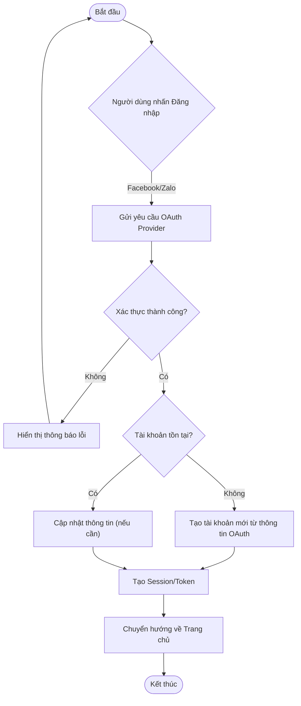
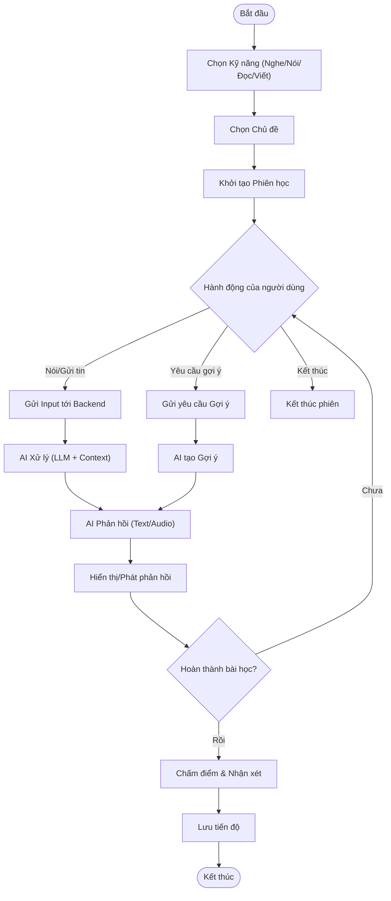
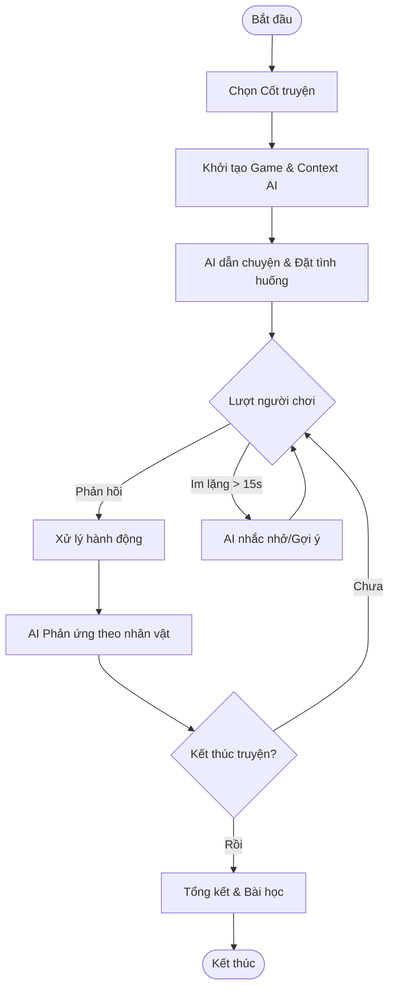

# Software Requirements Specification (SRS) - Next Generation Private Tutor

## 1. Giới thiệu (Introduction)

### 1.1. Mục đích (Purpose)

Tài liệu này mô tả chi tiết các yêu cầu phần mềm cho dự án **Next Generation Private Tutor (Next Tutor)**. Mục đích là cung cấp một cơ sở thống nhất cho đội ngũ phát triển (Development Team) và Product Owner (PO) về các chức năng, hiệu năng, và giao diện của phiên bản MVP (Minimum Viable Product). Tài liệu này cũng đóng vai trò là cơ sở để đội ngũ QA xây dựng kế hoạch và kịch bản kiểm thử.

### 1.2. Phạm vi (Scope)

Sản phẩm là một ứng dụng web (Web Application) hỗ trợ trẻ em (5-16 tuổi) học tiếng Anh thông qua tương tác với gia sư ảo AI. Phiên bản MVP tập trung vào các tính năng cốt lõi: xác thực người dùng, lựa chọn gia sư AI, luyện tập 4 kỹ năng (Nghe, Nói, Đọc, Viết) và chế độ game nhập vai.
Các tính năng nâng cao như thanh toán, mạng xã hội, và ứng dụng di động native nằm ngoài phạm vi của tài liệu này.

### 1.3. Định nghĩa và Thuật ngữ (Definitions and Acronyms)

* **MVP**: Minimum Viable Product - Sản phẩm khả thi tối thiểu.
* **AI Tutor**: Gia sư ảo được vận hành bởi các mô hình ngôn ngữ lớn (LLM).
* **BFF**: Backend For Frontend - Mẫu thiết kế backend phục vụ riêng cho frontend.
* **PWA**: Progressive Web App - Ứng dụng web có khả năng cài đặt và hoạt động giống ứng dụng native.
* **CCU**: Concurrent Users - Số lượng người dùng đồng thời.

## 2. Mô tả tổng quan (Overall Description)

### 2.1. Bối cảnh sản phẩm (Product Context)

Next Tutor là một hệ thống độc lập, bao gồm Frontend (Web/PWA), Backend (API Service), và tích hợp với các dịch vụ AI bên thứ ba (OpenAI, Grok, Gemini). Hệ thống sử dụng cơ sở dữ liệu PostgreSQL để lưu trữ thông tin người dùng và lịch sử học tập.

### 2.2. Chức năng chính (Product Functions)

* Đăng nhập/Đăng ký qua mạng xã hội.
* Cấu hình và tương tác với Gia sư AI (Voice/Text).
* Luyện tập kỹ năng qua các bài tập và trò chơi.
* Theo dõi tiến độ học tập.

### 2.3. Đặc điểm người dùng (User Characteristics)

* **Học viên (End User)**: Trẻ em 5-16 tuổi. Thích hình ảnh sinh động, tương tác đơn giản, ít kiên nhẫn với các thao tác phức tạp.
* **Phụ huynh**: Người hỗ trợ trẻ đăng nhập và theo dõi kết quả. Quan tâm đến sự an toàn và hiệu quả học tập.

## 3. Yêu cầu chức năng (Functional Requirements)

### 3.1. Quản lý tài khoản & Xác thực (Authentication)

* **FR-01**: Đăng nhập qua OAuth2.
  * *User Story*: Là một Học viên/Phụ huynh, tôi muốn đăng nhập bằng tài khoản Facebook hoặc Zalo để truy cập nhanh chóng mà không cần nhớ thêm mật khẩu.
  * *Acceptance Criteria*:
    * Hệ thống hiển thị nút "Đăng nhập bằng Facebook" và "Đăng nhập bằng Zalo".
    * Sau khi xác thực thành công, hệ thống tự động tạo tài khoản người dùng nếu chưa tồn tại và chuyển hướng vào màn hình chính.
    * Thông tin profile (tên, avatar) được đồng bộ từ mạng xã hội.

### 3.2. Cấu hình Gia sư ảo (AI Tutor Configuration)

* **FR-02**: Lựa chọn Gia sư AI.
  * *User Story*: Là một Học viên, tôi muốn chọn nhân vật gia sư (ví dụ: Gấu, Thỏ, Robot) và tính cách của họ để cảm thấy hứng thú hơn khi học.
  * *Acceptance Criteria*:
    * Người dùng có thể xem danh sách các nhân vật gia sư khả dụng (tối thiểu 3 nhân vật).
    * Mỗi nhân vật có hình ảnh đại diện, tên và mô tả tính cách ngắn gọn.
    * Lựa chọn của người dùng được lưu lại cho các phiên đăng nhập sau.

### 3.3. Học tập & Luyện tập (Learning & Practice)

* **FR-03**: Luyện Speaking & Listening qua Voice Chat.
  * *User Story*: Là một Học viên, tôi muốn trò chuyện bằng giọng nói với gia sư AI về một chủ đề cụ thể để luyện kỹ năng Nghe và Nói.
  * *Acceptance Criteria*:
    * **Chức năng cơ bản**:
      * Người dùng nhấn giữ nút Micro để nói và thả ra để gửi.
      * Gia sư AI phản hồi bằng giọng nói (Text-to-Speech) và văn bản trong vòng 3 giây.
      * Hội thoại diễn ra theo ngữ cảnh chủ đề đã chọn.
    * **Hành vi & Tính cách AI (AI Behavior)**:
      * **Giọng điệu**: Thân thiện, kiên nhẫn, khuyến khích, giống bạn đồng hành.
      * **Ngôn ngữ TTS**: Giọng đọc tự nhiên, rõ ràng, chuẩn Anh-Mỹ (hoặc Anh-Anh).
      * **Cấu trúc hội thoại**: Duy trì cấu trúc tự nhiên (mở đầu, phát triển, kết thúc), không ngẫu hứng.
      * **Chiến lược giao tiếp**: Sử dụng câu hỏi mở để khuyến khích học viên nói.
      * **Thích ứng trình độ**: Tự động điều chỉnh từ vựng, tốc độ nói theo trình độ (A2, B1, etc.).
      * **Động lực**: Nhận biết và khen ngợi điểm tốt của học viên.
    * **Nội dung & Chủ đề (Content)**:
      * **Danh sách chủ đề**: Cung cấp chủ đề phổ biến (Du lịch, Sở thích, Thời tiết) và chủ đề văn hóa Việt Nam.
      * **Tạo chủ đề**: Cho phép học viên tự nhập chủ đề mong muốn.
    * **Cài đặt & Tùy chỉnh (Settings)**:
      * **Trình độ học viên**: Cho phép chọn trình độ (A2, B1, B2, Starters, Movers, Flyers).
      * **Tùy chỉnh sửa lỗi**: Tùy chọn tần suất sửa lỗi (ngay lập tức, sau 3-4 câu, hoặc khi yêu cầu).
      * **Mục tiêu**: Chọn mục tiêu buổi học (phát âm, từ vựng, trôi chảy).
    * **Đánh giá & Theo dõi (Assessment)**:
      * AI cung cấp đánh giá ngắn gọn sau buổi học về mức độ đạt mục tiêu.
      * Hệ thống ghi lại tổng thời gian luyện tập.
    * **Yêu cầu Kỹ thuật (Technical Constraints)**:
      * Thiết bị: Microphone hoạt động tốt.
      * Kết nối: Internet ổn định.
      * Thời lượng: Giới hạn 10-15 phút/phiên để đảm bảo tập trung.

* **FR-04**: Luyện Reading & Listening qua Quiz.
  * *User Story*: Là một Học viên, tôi muốn làm các bài trắc nghiệm để kiểm tra kỹ năng Đọc và Nghe hiểu.
  * *Acceptance Criteria*:
    * **Chức năng cơ bản**:
      * Hiển thị câu hỏi và 4 đáp án lựa chọn.
      * Phát âm thanh cho câu hỏi (kỹ năng Nghe).
      * Thông báo kết quả Đúng/Sai ngay lập tức.
    * **Giao diện (UI)**:
      * Sạch sẽ, dễ đọc, không gây xao nhãng.
      * Lựa chọn đáp án rõ ràng, dễ thao tác.
    * **Phản hồi & Hỗ trợ (Feedback & Support)**:
      * **Phản hồi chi tiết**: Giải thích lý do đúng/sai. Hiển thị script cho bài nghe sau khi trả lời.
      * **Công cụ hỗ trợ**: Tích hợp từ điển tra cứu nhanh, tua lại/nghe lại (có giới hạn số lần).
    * **Nội dung & Tài liệu (Content)**:
      * **Chất lượng âm thanh**: Rõ ràng, chuẩn giọng bản xứ.
      * **Kho tài liệu**: Đa dạng (tin tức, khoa học, đời sống), cập nhật thường xuyên.
      * **Ngân hàng câu hỏi**: Phong phú, tránh lặp lại.
      * **Loại câu hỏi**: Trắc nghiệm, điền từ, nối từ, sắp xếp câu.
    * **Thích ứng & Cá nhân hóa (Adaptation)**:
      * **Lựa chọn trình độ**: A1, B1, C1, Starters, Movers, Flyers.
      * **Thích ứng độ khó**: Tự động điều chỉnh dựa trên kết quả trước đó.
      * **Độ dài/Phức tạp**: Ngắn/đơn giản cho trình độ thấp; dài/phức tạp cho trình độ cao.
      * **Chủ đề yêu thích**: Cho phép chọn chủ đề (khoa học, thể thao, v.v.).
    * **Cấu trúc & Thời gian (Structure)**:
      * **Độ dài quiz**: Tùy chọn (5, 10, 20 câu).
      * **Giới hạn thời gian**: Tùy chọn (ví dụ: 60s/câu) để mô phỏng thi cử.
      * **Mô phỏng bài thi**: Cấu trúc giống IELTS/TOEIC Junior.
    * **Báo cáo (Reporting)**:
      * Báo cáo kỹ năng cải thiện sau mỗi quiz.
      * Hiển thị thời gian làm bài trung bình.
      * Bảng xếp hạng/Huy hiệu để tạo động lực.

* **FR-05**: Luyện Writing qua Sắp xếp câu.
  * *User Story*: Là một Học viên, tôi muốn sắp xếp các từ xáo trộn thành câu hoàn chỉnh để luyện kỹ năng Viết và Ngữ pháp.
  * *Acceptance Criteria*:
    * Giao diện kéo thả hoặc click chọn từ để sắp xếp.
    * Nút "Kiểm tra" để xác nhận kết quả.

* **FR-06**: Chế độ Game nhập vai (Role-play).
  * *User Story*: Là một Học viên, tôi muốn đóng vai một nhân vật trong câu chuyện cổ tích để học tiếng Anh một cách tự nhiên.
  * *Acceptance Criteria*:
    * **Giao diện & Trải nghiệm (UI/UX)**:
      * **Hình ảnh & Âm thanh**: Minh họa 2D (tĩnh/động), âm thanh vui nhộn.
      * **Tương tác**: Lựa chọn rõ ràng, biểu tượng lớn.
      * **Giọng nói AI**: Biểu cảm, thân thiện, thay đổi theo vai nhân vật.
    * **Cơ chế Game (Game Mechanics)**:
      * **Cấu trúc**: Chuỗi sự kiện/tương tác. AI dẫn chuyện -> Đặt tình huống -> Người dùng phản hồi -> Diễn biến tiếp theo.
      * **Thời lượng**: 10-15 phút/phiên.
      * **Lưu tiến độ**: Cơ chế "đóng gói" để dừng và tiếp tục sau.
    * **Hành vi AI (AI Behavior)**:
      * **Đa vai**: AI đóng vai người dẫn chuyện và các nhân vật phụ.
      * **Quản lý ngữ cảnh**: Duy trì mạch truyện và tính nhất quán của nhân vật.
      * **Thích ứng ngôn ngữ**: Đơn giản hóa từ vựng/ngữ pháp theo trình độ học viên.
      * **Hỗ trợ**: Gợi ý từ vựng/cấu trúc khi người dùng gặp khó khăn.
    * **Nội dung (Content)**:
      * **Thư viện truyện**: Tối thiểu 3 cốt truyện (Việt Nam & Quốc tế).
      * **Chủ đề**: Phiêu lưu, khám phá, nhân vật dễ thương.
      * **Ví dụ tương tác**: (Xem chi tiết trong SRS gốc).
    * **Đánh giá (Assessment)**:
      * Đánh giá sự tham gia, khả năng duy trì hội thoại và sự sáng tạo.

### 3.4. Hệ thống phản hồi & Đánh giá (Feedback & Assessment)

* **FR-07**: Chấm điểm phát âm cơ bản.
  * *User Story*: Là một Học viên, tôi muốn biết mình phát âm đúng hay sai để sửa chữa.
  * *Acceptance Criteria*:
    * **Chức năng**: Đánh giá theo thang điểm (1-5 sao hoặc %).
    * **Chất lượng phản hồi**:
      * **Chi tiết**: Chỉ rõ lỗi âm vị, từ, trọng âm.
      * **Gợi ý hành động**: Hướng dẫn cách sửa (ví dụ: đặt lưỡi, khẩu hình).
      * **Giọng điệu**: Thân thiện, xây dựng, tiếng Việt dễ hiểu.
    * **Phạm vi đánh giá**:
      * Phù hợp trình độ A1-A2/Starter-Flyer.
      * Tập trung lỗi cơ bản, dễ sửa. Không quá chú trọng ngữ điệu phức tạp.
    * **Yêu cầu Kỹ thuật**:
      * Thiết bị: Mobile/Tablet có mic.
      * Tốc độ: Phản hồi < 3 giây.
      * Lưu trữ: Lịch sử chấm điểm và biểu đồ tiến độ.

* **FR-08**: Gợi ý và Động viên.
  * *User Story*: Là một Học viên, tôi muốn nhận được gợi ý khi không biết trả lời để không bị nản chí.
  * *Acceptance Criteria*:
    * **Tự động**: Sau 15s không tương tác, AI đưa ra gợi ý/động viên.
    * **Chủ động**: Nút "Gợi ý" cho người dùng.
    * **Chiến lược**: Ưu tiên 1-2 lỗi quan trọng nhất. Luôn kèm lời khen.
    * **Công cụ**: Tùy chọn nghe lại phát âm chuẩn vs phát âm của mình.

### 3.5. Báo cáo tiến độ (Progress Reporting)

* **FR-09**: Dashboard theo dõi học tập.
  * *User Story*: Là một Học viên, tôi muốn xem lại mình đã học được bao nhiêu phút và đạt điểm số thế nào trong tuần qua.
  * *Acceptance Criteria*:
    * Hiển thị biểu đồ số phút học tập trong 7 ngày gần nhất.
    * Hiển thị biểu đồ radar kỹ năng (Nghe, Nói, Đọc, Viết).

## 3.6. Biểu đồ hoạt động (Activity Diagrams)

Để hỗ trợ đội ngũ phát triển trong việc thiết kế chi tiết, dưới đây là các biểu đồ hoạt động mô tả các luồng nghiệp vụ chính.

### 3.6.1. Luồng Đăng nhập & Xác thực (Authentication Flow)

### 3.6.2. Luồng Phiên học tập (Learning Session Flow)

### 3.6.3. Luồng Game nhập vai (Role-play Game Flow)

## 4. Yêu cầu phi chức năng (Non-functional Requirements)

### 4.1. Hiệu năng (Performance)

* **NFR-01**: Tốc độ phản hồi của gia sư AI (bao gồm cả xử lý LLM và TTS) phải dưới **3 giây** cho 90% các yêu cầu tương tác voice/text trong điều kiện mạng ổn định.
* **NFR-02**: Hệ thống Backend phải hỗ trợ đồng thời ít nhất **50 người dùng (CCU)** mà không gặp lỗi quá tải hoặc timeout.

### 4.2. Bảo mật (Security)

* **NFR-03**: Tuyệt đối **không lưu trữ API Key** của các dịch vụ AI (OpenAI, Grok, Gemini) tại phía Client (Frontend). Mọi giao tiếp với AI phải thông qua Backend (BFF).
* **NFR-04**: Dữ liệu cá nhân của trẻ (tên, giọng nói ghi âm) phải được bảo vệ và không được chia sẻ cho bên thứ ba ngoài mục đích xử lý của AI (theo chính sách quyền riêng tư).

### 4.3. Khả năng sử dụng (Usability)

* **NFR-05**: Giao diện phải tuân thủ nguyên tắc "Kid-friendly": màu sắc tươi sáng, font chữ lớn, icon dễ hiểu, hạn chế tối đa văn bản dài dòng.
* **NFR-06**: Tối ưu cho thao tác chạm (touch) trên thiết bị di động và click chuột trên máy tính.

### 4.4. Khả năng tin cậy (Reliability)

* **NFR-07**: Hệ thống phải có cơ chế **Rotation API Key** để đảm bảo dịch vụ không bị gián đoạn do giới hạn quota của một tài khoản AI đơn lẻ.

## 5. Yêu cầu giao diện người dùng (User Interface Requirements)

### 5.1. Phong cách thiết kế (Design Style)

* **Màu sắc**: Sử dụng bảng màu tươi sáng (Vàng, Xanh dương, Cam, Xanh lá). Tránh màu đen tuyền hoặc xám xịt.
* **Typography**: Font chữ không chân, bo tròn (Rounded Sans-serif) như Quicksand hoặc Nunito. Kích thước chữ tối thiểu 16px cho văn bản thường và 24px cho tiêu đề.

### 5.2. Bố cục và Điều hướng (Layout & Navigation)

* Sử dụng **Bottom Navigation Bar** (trên Mobile) hoặc **Sidebar** lớn (trên Desktop) với các icon minh họa rõ ràng (Nhà, Sách, Cúp, Cài đặt).
* Các nút hành động chính (Primary Action) như "Nói", "Gửi", "Tiếp tục" phải có kích thước lớn, nổi bật và dễ bấm.

### 5.3. Trải nghiệm tương tác (UX)

* Hiển thị trạng thái "Đang suy nghĩ" hoặc "Đang nghe" của nhân vật AI bằng các animation sinh động (thay vì spinner loading truyền thống).
* Phản hồi xúc giác (Haptic feedback) hoặc âm thanh vui nhộn khi người dùng hoàn thành bài tập đúng.

## 6. Các yêu cầu khác (Other Requirements)

### 6.1. Yêu cầu công nghệ (Technology Stack)

* **Backend**: Spring Boot (Java) hoặc Python (FastAPI/Django). Ưu tiên Java (Spring Boot) phiên bản 21.
* **Frontend**: Angular 17. Xây dựng dưới dạng SPA (Single Page Application).
* **Database**: PostgreSQL 15.
* **AI Integration**: Tích hợp đa mô hình (Grok, Gemini, OpenAI) thông qua lớp Adapter tại Backend.

### 6.2. Môi trường triển khai (Deployment)

* Hệ thống có thể triển khai trên các nền tảng Cloud phổ biến (AWS, GCP, Azure) hoặc VPS thông thường.
* Hỗ trợ Docker để dễ dàng đóng gói và triển khai.

## 7. Phạm vi bàn giao (Deliverables Scope)

Dựa trên giới hạn thời gian 1 tuần, sản phẩm bàn giao bao gồm:

1. Source code đầy đủ (Frontend, Backend).
2. Script khởi tạo Database.
3. Tài liệu hướng dẫn cài đặt và chạy (README.md).
4. File APK/PWA hoặc đường dẫn truy cập Web App đã deploy (nếu có).
